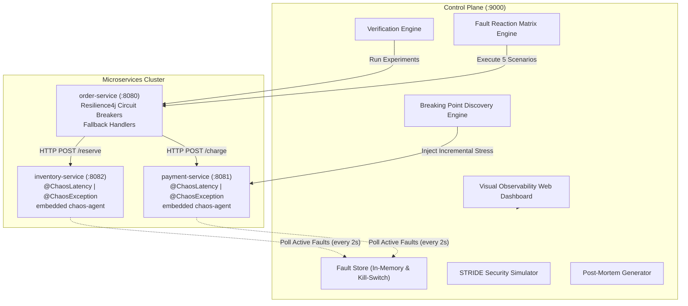

# ⚡ Chaos Engineering Toolkit & Agent for Spring Boot Microservices

[](https://www.oracle.com/java/)
[](https://spring.io/projects/spring-boot)
[](https://resilience4j.readme.io/)
[]()
[]()
[](LICENSE)

A production-grade, end-to-end **Chaos Engineering Platform** and **Zero-Dependency Chaos Agent** built natively for Spring Boot microservices. It features automated steady-state hypothesis testing, **Resilience4j Circuit Breaker verification**, **exact Breaking Point discovery**, a **5-scenario Comparative Fault Reaction Matrix**, **STRIDE Synthetic Security Chaos**, and an **interactive visual observability web dashboard**.

---

## 📑 Table of Contents
1. [System Architecture](#-system-architecture)
2. [Visual Observability Dashboard](#-visual-observability-dashboard)
3. [Core Capabilities](#-core-capabilities)
   - [Zero-Dependency Chaos Agent](#1-zero-dependency-chaos-agent-chaos-agent)
   - [Centralized Control Plane](#2-centralized-control-plane-chaos-toolkit)
   - [Breaking Point Discovery Engine](#3-breaking-point-discovery-engine)
   - [Comparative Fault Reaction Matrix](#4-comparative-fault-reaction-matrix)
   - [Mathematical Resilience Scoring Model](#5-mathematical-resilience-scoring-model)
   - [STRIDE Synthetic Security Chaos](#6-stride-synthetic-security-chaos)
   - [Deterministic Rule-Based Post-Mortem Generator](#7-deterministic-rule-based-post-mortem-generator)
4. [Demo Microservices Cluster](#-demo-microservices-cluster)
5. [Complete REST API Reference](#-complete-rest-api-reference)
6. [Quick Start & Execution](#-quick-start--execution)
7. [Repository Structure](#-repository-structure)
8. [Storage Architecture (In-Memory vs Database)](#-storage-architecture)

---

## 🏛 System Architecture

The ecosystem consists of three decoupled layers: the **Control Plane (`chaos-toolkit`)**, the **Target Microservices Cluster (`demo-apps`)** with embedded **`chaos-agent`**, and the **Interactive Web UI**.



---

## 🖥 Visual Observability Dashboard

Access the real-time visual control hub at **`http://localhost:9000/`**.

```
┌────────────────────────────────────────────────────────────────────────────────────────┐
│  ⚡ CHAOS TOOLKIT — OBSERVABILITY & RESILIENCE HUB           [Auto-Traffic: ON] [KILL] │
├────────────────────────────────────────────────────────────────────────────────────────┤
│  ┌──────────────────────────────────────────────┐  ┌─────────────────────────────────┐ │
│  │ 🌐 LIVE NETWORK TOPOLOGY CANVAS              │  │ 📈 RESILIENCE STREAM (Chart.js) │ │
│  │                                              │  │                                 │ │
│  │  [order-service] ───(●)───▶ [payment-svc]    │  │   Response Time (ms) Line Chart │ │
│  │        │                                     │  │   Circuit Breaker Failure Rate  │ │
│  │        └────────────(●)───▶ [inventory-svc]  │  │   Outcome Doughnut (OK/FB/ERR)  │ │
│  │                                              │  │                                 │ │
│  └──────────────────────────────────────────────┘  └─────────────────────────────────┘ │
│                                                                                        │
│  ┌──────────────────────────────────────────────┐  ┌─────────────────────────────────┐ │
│  │ 💥 BREAKING POINT DISCOVERY CURVE (Chart.js) │  │ 🔬 COMPARATIVE FAULT MATRIX (5) │ │
│  │                                              │  │                                 │ │
│  │  Latency & Error Rate vs Injected Stress     │  │ [Baseline] [Jitter] [Latency]   │ │
│  │  Red Dashed SLO Line (2000ms)                │  │ [50% Flaky] [100% Outage]       │ │
│  │  Calculated Tipping Point: Step 4 (1400ms)   │  │ Status: RESILIENT / FALLBACK    │ │
│  └──────────────────────────────────────────────┘  └─────────────────────────────────┘ │
│                                                                                        │
│  ┌──────────────────────────────────────────────┐  ┌─────────────────────────────────┐ │
│  │ 🛡️ STRIDE SECURITY SIMULATOR                 │  │ 📋 DETERMINISTIC POST-MORTEM    │ │
│  │  [Credential Stuffing] [Privilege Escalation]│  │  Automated Root Cause Analysis  │ │
│  │  [Payload Tampering]   [Config Drift]        │  │  Markdown Incident Report View  │ │
│  └──────────────────────────────────────────────┘  └─────────────────────────────────┘ │
└────────────────────────────────────────────────────────────────────────────────────────┘
```

### Key UI Features:
1. **Live Animated Canvas Vector Topology**: Renders moving request packets across services. Color coding reflects packet health:
   - 🟢 **Green**: Normal execution (< 500ms)
   - 🟡 **Amber**: Delayed / Jitter in flight
   - 🔴 **Red**: Fault injected / Exception thrown
   - 🟠 **Yellow**: Fallback handler activated by Circuit Breaker
2. **Interactive Degradation Curve**: Plots latency and error rates against 7 stress steps, marking the exact breaking point when latency breaches the 2000ms SLO.
3. **5-Scenario Comparative Matrix Grid**: Side-by-side scenario comparison cards displaying throughput, error rate, fallback rate, circuit state, and resiliency verdict.
4. **Auto-Traffic Simulator**: Toggle switch in the top header generating continuous 1 req/sec background traffic for real-time monitoring.

---

## ⚡ Core Capabilities

### 1. Zero-Dependency Chaos Agent (`chaos-agent`)
- **Independent Library (v0.1.0)**: Sits as a lightweight Maven dependency in target applications without coupling them to the control plane.
- **Spring AOP `@Around` Interceptor**: Intercepts methods annotated with `@ChaosLatency` or `@ChaosException`.
- **Probabilistic Blast Radius**: Injects faults with configurable probability ($0.0 \to 1.0$) using cryptographically secure random distribution.
- **Dynamic Daemon Poller**: Periodically fetches active fault configurations every 2 seconds via `RestClient`.
- **Local & Remote Kill Switches**: Instantly deactivates fault execution if a kill-switch signal is detected.

```java
@Service
public class PaymentGateway {

    @ChaosLatency(defaultMinMs = 100, defaultMaxMs = 500)
    @ChaosException(defaultException = RuntimeException.class, defaultMessage = "Gateway Timeout")
    public PaymentResponse processPayment(PaymentRequest request) {
        // Business logic runs here normally when no faults are active
        return new PaymentResponse("TX-" + UUID.randomUUID(), "SUCCESS");
    }
}
```

---

### 2. Centralized Control Plane (`chaos-toolkit`)
- **Port**: `9000`
- **In-Memory Fault Registry**: High-concurrency thread-safe `ConcurrentHashMap` managing active faults per service.
- **Global Kill Switch**: Immediate emergency disengagement across all services (`POST /api/v1/admin/kill-switch/engage`).

---

### 3. Breaking Point Discovery Engine
Automatically conducts incremental stress testing to find the exact resilience boundary of your microservices:
- **Parameter Sweeps**: Progressively increments latency from **200ms $\to$ 2600ms** and blast radius from **40% $\to$ 100%** across 7 granular steps.
- **SLO Breach Detection**: Continuously checks average latency and P95 latency against the target SLO threshold (default: 2000ms).
- **Exact Tipping Point Classification**: Identifies the step, latency, and blast radius where the service transitioned from resilient to degraded or failed.

---

### 4. Comparative Fault Reaction Matrix
Executes 5 standardized chaos test scenarios back-to-back with automatic circuit resets:

| Scenario | Injected Condition | Expected System Reaction | Resilience Verdict |
| :--- | :--- | :--- | :---: |
| **1. Healthy Baseline** | Normal operation (0ms latency, 0% errors) | Direct 200 OK, Closed Circuit | `RESILIENT` |
| **2. Mild Jitter** | 300ms latency, 100% blast radius | Slight delay, within acceptable SLO | `RESILIENT` |
| **3. Severe Latency** | 2500ms latency, 100% blast radius | Circuit Breaker triggers timeout fallback | `FALLBACK_PROTECTED` |
| **4. 50% Flaky Outage** | 50% random exceptions | Retries / Fallbacks absorb intermittent failures | `RESILIENT` |
| **5. 100% Total Outage** | 100% service failure | Circuit opens, immediate fast fallback protection | `FALLBACK_PROTECTED` |

---

### 5. Mathematical Resilience Scoring Model
Evaluates system resilience numerically based on steady-state telemetry:

$$\text{detect\_score} = \text{clamp}\left(1 - \frac{t_{\text{detect}}}{T_{\text{detect\_threshold}}}, 0, 1\right)$$

$$\text{recover\_score} = \text{clamp}\left(1 - \frac{t_{\text{recover}}}{T_{\text{recover\_threshold}}}, 0, 1\right)$$

$$\text{fallback\_score} = \text{fallback\_success\_rate}$$

$$\text{raw\_score} = (0.35 \cdot \text{detect\_score}) + (0.35 \cdot \text{recover\_score}) + (0.30 \cdot \text{fallback\_score})$$

$$\text{severity\_adjusted\_score} = \text{raw\_score} \cdot \text{severity\_weight}(\text{fault\_type}, \text{blast\_radius})$$

**Grading Scale**:
- **A (90–100%)**: Exceptional resilience, instant circuit trip, 100% fallback handling.
- **B (80–89%)**: High resilience, minor recovery lag.
- **C (70–79%)**: Moderate resilience, degraded customer experience.
- **D (60–69%)**: Poor resilience, SLO violations observed.
- **F (< 60%)**: Catastrophic failure, unhandled cascading exceptions.

---

### 6. STRIDE Synthetic Security Chaos
Simulates realistic security symptoms safely without executing dangerous payloads:

1. **Credential Stuffing (`Spoofing / Repudiation`)**: Simulates 100 rapid unauthorized login attempts to verify rate-limiting and audit logging.
2. **Privilege Escalation (`Elevation of Privilege`)**: Attempts horizontal/vertical unauthorized token execution.
3. **Malformed Payload Injection (`Tampering`)**: Sends corrupted schema JSON bodies to verify strict deserialization defenses.
4. **Lateral Movement (`Information Disclosure`)**: Checks for internal metadata exposure and debug endpoint leaks.
5. **Config Drift Simulation (`Security Misconfiguration`)**: Tests application defense against sudden unauthenticated actuator exposures.

---

### 7. Deterministic Rule-Based Post-Mortem Generator
Generates thorough, production-grade Root Cause Analysis (RCA) incident post-mortems in Markdown format:
- **No external LLM APIs required**: 100% deterministic, instant, reproducible, and private.
- Formats executive summary, timeline of events ($T_0 \to T_{\text{detect}} \to T_{\text{recover}}$), quantitative score breakdowns, and prioritized remediation steps.

---

## 📦 Demo Microservices Cluster

| Service | Port | Description | Resiliency Pattern |
| :--- | :---: | :--- | :--- |
| **`order-service`** | `8080` | Orchestrates orders by coordinating payment and inventory | Resilience4j Circuit Breakers + Fallback Handlers |
| **`payment-service`** | `8081` | Processes credit card and gateway payments | Annotated with `@ChaosLatency` & `@ChaosException` |
| **`inventory-service`**| `8082` | Reserves stock items for orders | Annotated with `@ChaosLatency` & `@ChaosException` |
| **`chaos-toolkit`** | `9000` | Central Control Plane & Observability Web Hub | In-memory fault engine & automated test suite |

---

## 📡 Complete REST API Reference

### 1. Control Plane & Fault Injection
| Method | Endpoint | Description |
| :--- | :--- | :--- |
| `GET` | `/api/v1/admin/faults` | List all active faults across all microservices |
| `POST` | `/api/v1/admin/faults/activate` | Activate a latency or exception fault on a target service |
| `DELETE` | `/api/v1/admin/faults/{service}/{faultId}` | Deactivate a specific fault |
| `DELETE` | `/api/v1/admin/faults/{service}` | Deactivate all faults for a service |
| `POST` | `/api/v1/admin/kill-switch/engage` | Engage global emergency kill switch |
| `POST` | `/api/v1/admin/kill-switch/release` | Release global kill switch |
| `GET` | `/api/v1/admin/kill-switch/status` | Check kill switch status |

### 2. Analytics & Experiment Engines
| Method | Endpoint | Description |
| :--- | :--- | :--- |
| `POST` | `/api/v1/verification/run` | Execute automated steady-state verification experiment |
| `POST` | `/api/v1/breaking-point/find` | Run automated breaking point discovery parameter sweep |
| `POST` | `/api/v1/fault-matrix/run` | Execute 5-scenario comparative fault reaction matrix |
| `POST` | `/api/v1/escalation/run` | Run multi-stage progressive chaos escalation plan |
| `POST` | `/api/v1/security-chaos/run` | Trigger synthetic STRIDE security chaos simulation |
| `GET` | `/api/v1/reports/post-mortem` | Generate deterministic markdown incident post-mortem |

### 3. Demo Application Endpoints
| Method | Endpoint | Description |
| :--- | :--- | :--- |
| `POST` | `http://localhost:8080/orders/create` | Place an order (triggers payment & inventory calls) |
| `GET` | `http://localhost:8080/orders/circuit-breakers` | Get live Resilience4j circuit breaker telemetry |
| `POST` | `http://localhost:8080/orders/circuit-breakers/reset` | Reset all circuit breakers to CLOSED state |

---

## 🚀 Quick Start & Execution

### Prerequisites
- **Java 21** (JDK 21+)
- **Maven 3.9+** (or included `mvnw`)
- **PowerShell** / **CMD** (Windows) or **Bash** (macOS/Linux)

---

### 1. Clone the Repository
```bash
git clone https://github.com/PrajyotKorde-18/Chaos-Toolkit.git
cd Chaos-Toolkit
```

---

### 2. One-Click Cluster Startup
Use the provided automation scripts to compile and launch all 4 services concurrently in the background:

**Windows (PowerShell):**
```powershell
.\start-all.ps1
```

**Windows (Command Prompt):**
```cmd
start-all.bat
```

---

### 3. Verify System Health
Run the end-to-end automated test suite:
```powershell
.\test-e2e.ps1
```

---

### 4. Open the Web Dashboard
Navigate to **`http://localhost:9000/`** in your browser to inspect live vector topologies, run breaking point analyses, and trigger comparative matrix scenarios.

---

### 5. Stopping the Cluster
**Windows (PowerShell):**
```powershell
.\stop-all.ps1
```

---

## 📁 Repository Structure

```
Chaos-Toolkit/
├── README.md                           # Master documentation and architecture guide
├── .gitignore                          # Git ignore rules
├── start-all.ps1 / start-all.bat       # One-click startup script for all 4 services
├── stop-all.ps1 / stop-all.bat         # One-click graceful teardown script
├── test-e2e.ps1                        # 8-stage automated verification suite
│
├── chaos-agent/                        # Standalone Spring Boot 4.x library (v0.1.0)
│   ├── pom.xml
│   └── src/main/java/in/strikes/chaosagent/
│       ├── annotation/                 # @ChaosLatency, @ChaosException
│       ├── core/                       # ChaosInjectionAspect (AOP interceptor)
│       └── registry/                   # ChaosFaultRegistry (Dynamic 2s polling engine)
│
├── chaos-toolkit/                      # Central Control Plane & Observability Hub
│   ├── pom.xml
│   ├── src/main/java/in/strikes/chaostoolkit/
│   │   ├── Controller/                 # Admin, Verification, BreakingPoint, FaultMatrix APIs
│   │   ├── service/                    # FaultStore, BreakingPointService, FaultMatrixService
│   │   ├── service/escalation/         # Progressive multi-stage escalation engine
│   │   ├── service/security/           # STRIDE security simulator
│   │   ├── service/scoring/            # Mathematical resilience scoring calculator
│   │   └── service/report/             # Deterministic Post-Mortem markdown generator
│   ├── src/main/resources/
│   │   ├── application.properties      # Port 9000 configuration
│   │   └── static/index.html           # Real-time Canvas & Chart.js Web Dashboard
│   └── demo-apps/                      # Target microservices cluster
│       ├── order-service/              # Coordinator (:8080) with Resilience4j CBs
│       ├── payment-service/            # Target service (:8081) with embedded chaos-agent
│       └── inventory-service/          # Target service (:8082) with embedded chaos-agent
│
└── docs/                               # Comprehensive specifications and documentation
    ├── CURRENT_STATE.md                # Living status snapshot
    ├── MILESTONES.md                   # Build milestones and verification proofs
    ├── NAMING_AND_VERSIONS.md          # Versioning and naming conventions
    └── PROJECT_CONTEXT.md              # Detailed architecture philosophy
```

---

## 💾 Storage Architecture

### Default: Zero-Config In-Memory Architecture
By default, the system operates completely **in-memory** (`ConcurrentHashMap` and ring-buffered histories). 
- **Zero Configuration**: No PostgreSQL, Supabase, or external database setup required.
- **Air-Gapped & Portable**: Runs anywhere locally or in CI/CD pipelines in sub-second time.
- **High Throughput**: Microsecond state lookups for high-frequency polling.

### Optional: Supabase / PostgreSQL Persistence Profile
If long-term persistence across restarts or team-wide audit compliance is desired, an optional Spring Data JPA profile can be activated (`--spring.profiles.active=supabase`) to persist test runs, breaking point reports, and post-mortems to relational tables.

---

## 📄 License
This project is licensed under the **MIT License**.
